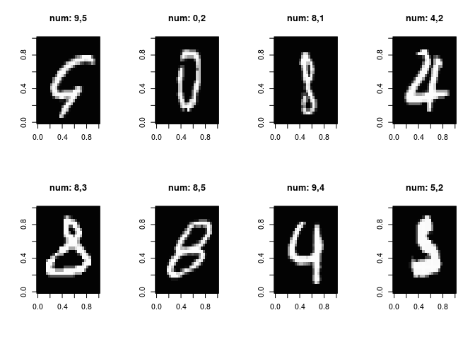

Keras\_Intro\_Basics
================

### Keras

-   빠른 모형 프로토타이핑을 통한 연구 효율 증대
-   API사용이 쉽고 오사용으로 인한 시행착오를 줄여준다.
-   GPU, CPU 모두 사용 가능
-   다양한 backend 활용 가능

#### R interface to Keras

-   Python 버전의 Keras를 R에서 활용 가능하게 Wrapping한 패키지
-   R의 강점을 딥러닝을 하는데 활용 가능
-   간결한 API, 복잡한 import사용을 하지 않아도 된다.
-   reticulate 기반으로 동작해 keras의 최신 기능을 바로 활용 가능하다.

### Keras 설치

    devtools::install_github("rstudio/keras")
    library(keras)
    install_tensorflow()

### A first neural network in Keras

``` r
library(keras)
library(reticulate)
```

#### 데이터 로딩과 샘플 플로팅

``` r
batch_size <- 32
num_classes <- 10
epochs <- 10

# the data, shuffled and split between train and test sets
mnist <- dataset_mnist()
x_train <- mnist$train$x
y_train <- mnist$train$y
x_test <- mnist$test$x
y_test <- mnist$test$y
```

``` r
x_train <- array(as.numeric(x_train), dim = c(dim(x_train)[[1]], 784))
x_test <- array(as.numeric(x_test), dim = c(dim(x_test)[[1]], 784))

# convert class vectors to binary class matrices
y_train <- to_categorical(y_train, num_classes)
y_test <- to_categorical(y_test, num_classes)


print(sprintf("x_train dimension : %d, %d", dim(x_train)[1], dim(x_train)[2]))
```

    ## [1] "x_train dimension : 60000, 784"

``` r
print(sprintf("y_train dimension : %d, %d", dim(y_train)[1], dim(y_train)[2]))
```

    ## [1] "y_train dimension : 60000, 10"

``` r
plot_examples <- function(data, labels, model_predict){
    par(mfrow=c(2,4))
    for(i in 1:8){
        idx <- sample(seq(dim(data)[1]), 1)
        lab <- paste0("num: " , which.max(labels[idx,]) - 1 , "," , which.max(model_predict[idx,]) - 1)
        image(t(apply(array(data[idx,], dim = c(28,28)), 2, rev)),
              col=paste("gray",1:99,sep=""),main=lab)
    }
}

plot_examples(x_train, y_train, y_train)
```


#### Building a first Keras model

-   간단한 3층의 앞먹임(feedforward) 네트워크
-   3 step:
    -   모델 빌드
        -   옵티마이저(optimizer)와 로스(loss)를 기반으로 모델 컴파일
            -   모형에 저장된 가중치와 바이어스에 영향 없이 learning rate와 optimizer 등의 설정을 바꿀 수 있다.
        -   `model %>% fit`을 호출해 학습을 시작한다.

``` r
# Keras는 두가지 모델링 API를 제공한다.  
#    1. Sequential - 복잡하지 않은 단순한 네트웍을 구성할때 
#    2. Functional - 복잡한 네트웍을 구성할때 

# input layer
inputs <- layer_input(shape = c(784))
 

# 모형 구조 구성 
# keras는 각 레이어를 순서에 맞게 구성하면 해당 입력 차원에 대한 명시적인 선언을 하지 않아도 된다. 
# 해당 레이어에서 출력되는 차원을 명시하고 activation 함수를 정의한다.  
predictions <- inputs %>%
  layer_dense(units = 128, activation = 'sigmoid') %>% 
  layer_dense(units = 10, activation = 'sigmoid')

# 모형을 생성한다. 
model <- keras_model(inputs = inputs, outputs = predictions)

#모형 구조 출력 
summary(model)
```

    ## Model
    ## ___________________________________________________________________________
    ## Layer (type)                     Output Shape                  Param #     
    ## ===========================================================================
    ## input_1 (InputLayer)             (None, 784)                   0           
    ## ___________________________________________________________________________
    ## dense_1 (Dense)                  (None, 128)                   100480      
    ## ___________________________________________________________________________
    ## dense_2 (Dense)                  (None, 10)                    1290        
    ## ===========================================================================
    ## Total params: 101,770
    ## Trainable params: 101,770
    ## Non-trainable params: 0
    ## ___________________________________________________________________________
    ## 
    ## 

``` r
sgd_lr <- optimizer_sgd(lr=0.01)
#컴파일 과정을 통해 최적화 조건을 선언한다. 
model %>% compile(
  optimizer = sgd_lr,
  loss = 'mse',
  metrics = c('accuracy')
)

#학습 
cat(py_capture_output({
  history <- model %>% fit(
    x_train, y_train,
    batch_size = batch_size,
    epochs = epochs,
    verbose = 2
  )
},type = 'stdout'))
```

    ## Epoch 1/10
    ## 2s - loss: 0.0877 - acc: 0.3918
    ## Epoch 2/10
    ## 1s - loss: 0.0602 - acc: 0.6669
    ## Epoch 3/10
    ## 1s - loss: 0.0495 - acc: 0.7590
    ## Epoch 4/10
    ## 1s - loss: 0.0427 - acc: 0.8054
    ## Epoch 5/10
    ## 1s - loss: 0.0381 - acc: 0.8296
    ## Epoch 6/10
    ## 1s - loss: 0.0347 - acc: 0.8474
    ## Epoch 7/10
    ## 1s - loss: 0.0320 - acc: 0.8587
    ## Epoch 8/10
    ## 1s - loss: 0.0300 - acc: 0.8680
    ## Epoch 9/10
    ## 1s - loss: 0.0283 - acc: 0.8742
    ## Epoch 10/10
    ## 1s - loss: 0.0269 - acc: 0.8796

``` r
#테스트셋 검증 
score <- model %>% evaluate(
  x_test, y_test,
  verbose = 0
)
  
cat('Test loss:', score[[1]], '\n')
```

    ## Test loss: 0.02578897

``` r
cat('Test accuracy:', score[[2]], '\n')
```

    ## Test accuracy: 0.8865

``` r
#plot history of epoch
plot(history)
```


#### 모델 재컴파일 예제

-   학습 중간에 옵티마이저와 로스함수를 수정할 수 있다.
-   이 기능은 모형의 업데이트가 크지 않을때 학습율을 조정하기 쉽게 한다.
-   여기서는 `validation_split`옵션을 이용해 학습 데이터의 일정 부분을 테스트 하기 위한 용도로 활용하고 이 결과를 학습이 진행되는 중간 중간 출력해준다.
    -   별도 셋을 구분하지 않아도 일정부분의 데이터를 기반으로 각 에폭 마지막에 loss와 metric을 계산해 줄력해준다.

``` r
inputs <- layer_input(shape = c(784))
 
predictions <- inputs %>%
  layer_dense(units = 128, activation = 'sigmoid') %>% 
  layer_dense(units = 10, activation = 'sigmoid')


model <- keras_model(inputs = inputs, outputs = predictions)

print("Learning rate is 0.1")
```

    ## [1] "Learning rate is 0.1"

``` r
sgd_lr <- optimizer_sgd(lr=0.1)

model %>% compile(
  optimizer = sgd_lr,
  loss = 'mse',
  metrics = c('accuracy')
)

#학습 
cat(py_capture_output({ 
  history <- model %>% fit(
    x_train, y_train,
    batch_size = batch_size,
    epochs = epochs,
    verbose = 2,
    validation_split= 0.2
)},type = 'stdout'))
```

    ## Train on 48000 samples, validate on 12000 samples
    ## Epoch 1/10
    ## 1s - loss: 0.0509 - acc: 0.7289 - val_loss: 0.0313 - val_acc: 0.8708
    ## Epoch 2/10
    ## 1s - loss: 0.0277 - acc: 0.8751 - val_loss: 0.0226 - val_acc: 0.8987
    ## Epoch 3/10
    ## 1s - loss: 0.0218 - acc: 0.8964 - val_loss: 0.0193 - val_acc: 0.9070
    ## Epoch 4/10
    ## 1s - loss: 0.0189 - acc: 0.9065 - val_loss: 0.0170 - val_acc: 0.9147
    ## Epoch 5/10
    ## 1s - loss: 0.0171 - acc: 0.9129 - val_loss: 0.0158 - val_acc: 0.9196
    ## Epoch 6/10
    ## 1s - loss: 0.0158 - acc: 0.9195 - val_loss: 0.0147 - val_acc: 0.9250
    ## Epoch 7/10
    ## 1s - loss: 0.0149 - acc: 0.9222 - val_loss: 0.0140 - val_acc: 0.9257
    ## Epoch 8/10
    ## 1s - loss: 0.0141 - acc: 0.9262 - val_loss: 0.0134 - val_acc: 0.9295
    ## Epoch 9/10
    ## 1s - loss: 0.0135 - acc: 0.9298 - val_loss: 0.0133 - val_acc: 0.9285
    ## Epoch 10/10
    ## 1s - loss: 0.0129 - acc: 0.9323 - val_loss: 0.0128 - val_acc: 0.9328

``` r
sgd_lr <- optimizer_sgd(lr=0.01)
print("Learning rate is 0.01")
```

    ## [1] "Learning rate is 0.01"

``` r
model %>% compile(
  optimizer = sgd_lr,
  loss = 'mse',
  metrics = c('accuracy')
)

#학습
cat(py_capture_output({ 
  history <- model %>% fit(
    x_train, y_train,
    batch_size = batch_size,
    epochs = epochs,
    verbose = 2,
    validation_split= 0.2
)},type = 'stdout'))
```

    ## Train on 48000 samples, validate on 12000 samples
    ## Epoch 1/10
    ## 1s - loss: 0.0123 - acc: 0.9345 - val_loss: 0.0121 - val_acc: 0.9337
    ## Epoch 2/10
    ## 1s - loss: 0.0118 - acc: 0.9372 - val_loss: 0.0119 - val_acc: 0.9347
    ## Epoch 3/10
    ## 1s - loss: 0.0116 - acc: 0.9389 - val_loss: 0.0118 - val_acc: 0.9358
    ## Epoch 4/10
    ## 1s - loss: 0.0114 - acc: 0.9398 - val_loss: 0.0117 - val_acc: 0.9354
    ## Epoch 5/10
    ## 1s - loss: 0.0112 - acc: 0.9411 - val_loss: 0.0117 - val_acc: 0.9357
    ## Epoch 6/10
    ## 1s - loss: 0.0111 - acc: 0.9420 - val_loss: 0.0116 - val_acc: 0.9370
    ## Epoch 7/10
    ## 1s - loss: 0.0109 - acc: 0.9429 - val_loss: 0.0116 - val_acc: 0.9368
    ## Epoch 8/10
    ## 1s - loss: 0.0108 - acc: 0.9435 - val_loss: 0.0115 - val_acc: 0.9364
    ## Epoch 9/10
    ## 1s - loss: 0.0107 - acc: 0.9439 - val_loss: 0.0115 - val_acc: 0.9362
    ## Epoch 10/10
    ## 1s - loss: 0.0106 - acc: 0.9446 - val_loss: 0.0115 - val_acc: 0.9363

``` r
sgd_lr <- optimizer_sgd(lr=0.001)
print("Learning rate is 0.001")
```

    ## [1] "Learning rate is 0.001"

``` r
model %>% compile(
  optimizer = sgd_lr,
  loss = 'mse',
  metrics = c('accuracy')
)

#학습 
cat(py_capture_output({
  history <- model %>% fit(
    x_train, y_train,
    batch_size = batch_size,
    epochs = epochs,
    verbose = 2,
    validation_split= 0.2
)},type = 'stdout'))
```

    ## Train on 48000 samples, validate on 12000 samples
    ## Epoch 1/10
    ## 1s - loss: 0.0105 - acc: 0.9460 - val_loss: 0.0115 - val_acc: 0.9367
    ## Epoch 2/10
    ## 1s - loss: 0.0104 - acc: 0.9464 - val_loss: 0.0115 - val_acc: 0.9366
    ## Epoch 3/10
    ## 1s - loss: 0.0104 - acc: 0.9465 - val_loss: 0.0115 - val_acc: 0.9364
    ## Epoch 4/10
    ## 1s - loss: 0.0104 - acc: 0.9466 - val_loss: 0.0115 - val_acc: 0.9366
    ## Epoch 5/10
    ## 1s - loss: 0.0104 - acc: 0.9466 - val_loss: 0.0115 - val_acc: 0.9364
    ## Epoch 6/10
    ## 1s - loss: 0.0104 - acc: 0.9468 - val_loss: 0.0115 - val_acc: 0.9364
    ## Epoch 7/10
    ## 1s - loss: 0.0104 - acc: 0.9468 - val_loss: 0.0115 - val_acc: 0.9364
    ## Epoch 8/10
    ## 1s - loss: 0.0104 - acc: 0.9469 - val_loss: 0.0115 - val_acc: 0.9366
    ## Epoch 9/10
    ## 1s - loss: 0.0103 - acc: 0.9469 - val_loss: 0.0115 - val_acc: 0.9367
    ## Epoch 10/10
    ## 1s - loss: 0.0103 - acc: 0.9471 - val_loss: 0.0114 - val_acc: 0.9367

#### 정확도(accuracy)출력을 위한 함수 작성

``` r
accuracy <- function(test_x, test_y, model){
  result <- predict(model,test_x)
  num_correct <- apply(result, 1, which.max) == apply(test_y, 1, which.max)
  accuracy <- sum(num_correct) / dim(result)[1]
  print(sprintf("Accuracy on data is: %f",accuracy * 100))
}
accuracy(x_test, y_test, model)
```

    ## [1] "Accuracy on data is: 93.630000"

### 오분류, 정분류 시각화를 통한 Error Analysis

``` r
get_correct_and_incorrect <- function(model, test_x, test_y){
  result <- predict(model,test_x)
  correct_indices <- apply(result, 1, which.max) == apply(test_y, 1, which.max)
  test_x_correct <- test_x[correct_indices,]
  test_y_correct <- test_y[correct_indices,]
  predict_test_y_correct <- result[correct_indices,]
  incorrect_indices <- apply(result, 1, which.max) != apply(test_y, 1, which.max)
  test_x_incorrect <- test_x[incorrect_indices,]
  test_y_incorrect <- test_y[incorrect_indices,]
  predict_test_y_incorrect <- result[incorrect_indices,]
  return(list(test_x_correct, test_y_correct, test_x_incorrect, test_y_incorrect, predict_test_y_correct, predict_test_y_incorrect))
}

predit_res <- get_correct_and_incorrect(model, x_test, y_test)
```

``` r
print(dim(predit_res[[1]]))
```

    ## [1] 9363  784

``` r
plot_examples(predit_res[[1]], predit_res[[2]], predit_res[[5]])
```


``` r
print(dim(predit_res[[3]]))
```

    ## [1] 637 784

``` r
plot_examples(predit_res[[3]], predit_res[[4]], predit_res[[6]])
```


#### MSE vs. categorical crossentropy loss functions

-   카테고리컬 크로스 엔트로피 loss는 MSE보다 더 빠른 수렴 효과를 보인다.
-   Softmax output은 10개중에 하나의 클래스를 선택하는 MNIST문제에 적합하다.
    -   한 노드의 확률이 높아지면 다른 노드의 확률들은 낮아져야 된다.

``` r
# Softmax output layer, mse
print("Quadratic (MSE)")
```

    ## [1] "Quadratic (MSE)"

``` r
inputs <- layer_input(shape = c(784))
 
predictions <- inputs %>%
  layer_dense(units = 128, activation = 'sigmoid') %>% 
  layer_dense(units = 10, activation = 'softmax')


model <- keras_model(inputs = inputs, outputs = predictions)


sgd_lr <- optimizer_sgd(lr=0.001)

model %>% compile(
  optimizer = sgd_lr,
  loss = 'mse',
  metrics = c('accuracy')
)

cat(py_capture_output({
  history <- model %>% fit(
    x_train, y_train,
    batch_size = 32,
    epochs = 10,
    verbose = 2,
    validation_split= 0.2,
    callbacks = callback_tensorboard(log_dir = "logs/mse")
)},type = 'stdout'))
```

    ## Train on 48000 samples, validate on 12000 samples
    ## Epoch 1/10
    ## 1s - loss: 0.0968 - acc: 0.0856 - val_loss: 0.0955 - val_acc: 0.0887
    ## Epoch 2/10
    ## 1s - loss: 0.0943 - acc: 0.1005 - val_loss: 0.0934 - val_acc: 0.1082
    ## Epoch 3/10
    ## 1s - loss: 0.0923 - acc: 0.1269 - val_loss: 0.0915 - val_acc: 0.1412
    ## Epoch 4/10
    ## 1s - loss: 0.0904 - acc: 0.1648 - val_loss: 0.0896 - val_acc: 0.1788
    ## Epoch 5/10
    ## 1s - loss: 0.0884 - acc: 0.2054 - val_loss: 0.0876 - val_acc: 0.2228
    ## Epoch 6/10
    ## 1s - loss: 0.0863 - acc: 0.2472 - val_loss: 0.0855 - val_acc: 0.2633
    ## Epoch 7/10
    ## 1s - loss: 0.0842 - acc: 0.2840 - val_loss: 0.0833 - val_acc: 0.3015
    ## Epoch 8/10
    ## 1s - loss: 0.0820 - acc: 0.3189 - val_loss: 0.0811 - val_acc: 0.3361
    ## Epoch 9/10
    ## 1s - loss: 0.0799 - acc: 0.3489 - val_loss: 0.0789 - val_acc: 0.3633
    ## Epoch 10/10
    ## 1s - loss: 0.0778 - acc: 0.3779 - val_loss: 0.0768 - val_acc: 0.3946

``` r
# Softmax output layer, categorical crossentropy
print("Categorical cross entropy")
```

    ## [1] "Categorical cross entropy"

``` r
inputs <- layer_input(shape = c(784))
 
predictions <- inputs %>%
  layer_dense(units = 128, activation = 'sigmoid') %>% 
  layer_dense(units = 10, activation = 'softmax')


model <- keras_model(inputs = inputs, outputs = predictions)


sgd_lr <- optimizer_sgd(lr=0.001)

model %>% compile(
  optimizer = sgd_lr,
  loss = 'categorical_crossentropy',
  metrics = c('accuracy')
)

cat(py_capture_output({
  history <- model %>% fit(
    x_train, y_train,
    batch_size = 32,
    epochs = 10,
    verbose = 2,
    validation_split= 0.2,
    callbacks = callback_tensorboard(log_dir = "logs/categorical_crossentropy")
)},type = 'stdout'))
```

    ## Train on 48000 samples, validate on 12000 samples
    ## Epoch 1/10
    ## 1s - loss: 1.4085 - acc: 0.6118 - val_loss: 0.9307 - val_acc: 0.7952
    ## Epoch 2/10
    ## 1s - loss: 0.8153 - acc: 0.8107 - val_loss: 0.6722 - val_acc: 0.8505
    ## Epoch 3/10
    ## 1s - loss: 0.6441 - acc: 0.8469 - val_loss: 0.5598 - val_acc: 0.8720
    ## Epoch 4/10
    ## 1s - loss: 0.5524 - acc: 0.8661 - val_loss: 0.4919 - val_acc: 0.8842
    ## Epoch 5/10
    ## 1s - loss: 0.4918 - acc: 0.8800 - val_loss: 0.4490 - val_acc: 0.8916
    ## Epoch 6/10
    ## 1s - loss: 0.4498 - acc: 0.8884 - val_loss: 0.4169 - val_acc: 0.8993
    ## Epoch 7/10
    ## 1s - loss: 0.4185 - acc: 0.8950 - val_loss: 0.3935 - val_acc: 0.9037
    ## Epoch 8/10
    ## 1s - loss: 0.3934 - acc: 0.9006 - val_loss: 0.3731 - val_acc: 0.9062
    ## Epoch 9/10
    ## 1s - loss: 0.3729 - acc: 0.9043 - val_loss: 0.3558 - val_acc: 0.9087
    ## Epoch 10/10
    ## 1s - loss: 0.3564 - acc: 0.9086 - val_loss: 0.3442 - val_acc: 0.9104

#### ReLU vs. Sigmoid

##### ReLU

-   학습을 위해 다소 적은 learning rate 필요
-   깊이가 얕은 네트웍에서는 Sigmoid보다 성능이 덜 나오는 경향이 있다.

``` r
# Relu hidden layer, 3 layer network
inputs <- layer_input(shape = c(784))
 
predictions <- inputs %>%
  layer_dense(units = 128, activation = 'relu') %>% 
  layer_dense(units = 10, activation = 'softmax')


model <- keras_model(inputs = inputs, outputs = predictions)


sgd_lr <- optimizer_sgd(lr=0.001)

model %>% compile(
  optimizer = sgd_lr,
  loss = 'categorical_crossentropy',
  metrics = c('accuracy')
)

cat(py_capture_output({
  history <- model %>% fit(
    x_train, y_train,
    batch_size = 32,
    epochs = 10,
    verbose = 2,
    validation_split= 0.2,
    callbacks = callback_tensorboard(log_dir = "logs/relu")
)},type = 'stdout'))
```

    ## Train on 48000 samples, validate on 12000 samples
    ## Epoch 1/10
    ## 1s - loss: 7.0273 - acc: 0.5584 - val_loss: 5.9405 - val_acc: 0.6267
    ## Epoch 2/10
    ## 1s - loss: 4.8536 - acc: 0.6927 - val_loss: 4.3083 - val_acc: 0.7279
    ## Epoch 3/10
    ## 1s - loss: 4.2936 - acc: 0.7289 - val_loss: 4.1170 - val_acc: 0.7412
    ## Epoch 4/10
    ## 1s - loss: 4.1143 - acc: 0.7411 - val_loss: 3.9842 - val_acc: 0.7489
    ## Epoch 5/10
    ## 1s - loss: 3.1038 - acc: 0.8021 - val_loss: 2.6893 - val_acc: 0.8282
    ## Epoch 6/10
    ## 1s - loss: 1.7887 - acc: 0.8826 - val_loss: 1.0682 - val_acc: 0.9283
    ## Epoch 7/10
    ## 1s - loss: 1.0322 - acc: 0.9313 - val_loss: 0.9212 - val_acc: 0.9387
    ## Epoch 8/10
    ## 1s - loss: 0.9695 - acc: 0.9352 - val_loss: 0.8362 - val_acc: 0.9442
    ## Epoch 9/10
    ## 1s - loss: 0.8652 - acc: 0.9421 - val_loss: 0.8126 - val_acc: 0.9450
    ## Epoch 10/10
    ## 1s - loss: 0.8278 - acc: 0.9447 - val_loss: 0.7858 - val_acc: 0.9468

``` r
# Sigmoid hidden layer, 3 layer network
inputs <- layer_input(shape = c(784))
 
predictions <- inputs %>%
  layer_dense(units = 128, activation = 'sigmoid') %>% 
  layer_dense(units = 10, activation = 'softmax')


model <- keras_model(inputs = inputs, outputs = predictions)

sgd_lr <- optimizer_sgd(lr=0.001)

model %>% compile(
  optimizer = sgd_lr,
  loss = 'categorical_crossentropy',
  metrics = c('accuracy')
)

cat(py_capture_output({
  history <- model %>% fit(
    x_train, y_train,
    batch_size = 32,
    epochs = 10,
    verbose = 2,
    validation_split= 0.2,
    callbacks = callback_tensorboard(log_dir = "logs/sigmoid")
)},type = 'stdout'))
```

    ## Train on 48000 samples, validate on 12000 samples
    ## Epoch 1/10
    ## 1s - loss: 1.4848 - acc: 0.5826 - val_loss: 0.9867 - val_acc: 0.7855
    ## Epoch 2/10
    ## 1s - loss: 0.8463 - acc: 0.8142 - val_loss: 0.6935 - val_acc: 0.8577
    ## Epoch 3/10
    ## 1s - loss: 0.6536 - acc: 0.8534 - val_loss: 0.5682 - val_acc: 0.8798
    ## Epoch 4/10
    ## 1s - loss: 0.5537 - acc: 0.8736 - val_loss: 0.4963 - val_acc: 0.8897
    ## Epoch 5/10
    ## 1s - loss: 0.4922 - acc: 0.8840 - val_loss: 0.4471 - val_acc: 0.8961
    ## Epoch 6/10
    ## 1s - loss: 0.4477 - acc: 0.8928 - val_loss: 0.4142 - val_acc: 0.9022
    ## Epoch 7/10
    ## 1s - loss: 0.4137 - acc: 0.8990 - val_loss: 0.3882 - val_acc: 0.9073
    ## Epoch 8/10
    ## 1s - loss: 0.3889 - acc: 0.9043 - val_loss: 0.3699 - val_acc: 0.9062
    ## Epoch 9/10
    ## 1s - loss: 0.3678 - acc: 0.9081 - val_loss: 0.3531 - val_acc: 0.9093
    ## Epoch 10/10
    ## 1s - loss: 0.3516 - acc: 0.9106 - val_loss: 0.3402 - val_acc: 0.9138

#### `Relu` 에게는 깊은 네트워크가 적합하다.

-   깊은 네트워크일 수록 예측 능력이 뛰어나다.
-   `Relu`는 깊은 네트워크일 수록 잘 동작하는데, 이는 positive input에 대해서 어떻게든지 gradient를 계산해서 가중치를 업데이트 하기 때문이다.

``` r
# Relu hidden layer, 6 layer network
inputs <- layer_input(shape = c(784))
 
predictions <- inputs %>%
  layer_dense(units = 512, activation = 'relu') %>% 
  layer_dense(units = 256, activation = 'relu') %>% 
  layer_dense(units = 128, activation = 'relu') %>% 
  layer_dense(units = 64, activation = 'relu') %>% 
  layer_dense(units = 10, activation = 'softmax')


model <- keras_model(inputs = inputs, outputs = predictions)


sgd_lr <- optimizer_sgd(lr=0.001)

model %>% compile(
  optimizer = sgd_lr,
  loss = 'categorical_crossentropy',
  metrics = c('accuracy')
)

cat(py_capture_output({
  history <- model %>% fit(
    x_train, y_train,
    batch_size = 32,
    epochs = 10,
    verbose = 2,
    validation_split= 0.2,
    callbacks = callback_tensorboard(log_dir = "logs/relu_6layer")
)},type = 'stdout'))
```

    ## Train on 48000 samples, validate on 12000 samples
    ## Epoch 1/10
    ## 2s - loss: 3.5382 - acc: 0.7453 - val_loss: 0.7275 - val_acc: 0.9097
    ## Epoch 2/10
    ## 2s - loss: 0.4336 - acc: 0.9222 - val_loss: 0.2942 - val_acc: 0.9277
    ## Epoch 3/10
    ## 2s - loss: 0.1945 - acc: 0.9520 - val_loss: 0.2380 - val_acc: 0.9437
    ## Epoch 4/10
    ## 2s - loss: 0.1296 - acc: 0.9655 - val_loss: 0.2202 - val_acc: 0.9457
    ## Epoch 5/10
    ## 2s - loss: 0.0906 - acc: 0.9763 - val_loss: 0.2027 - val_acc: 0.9513
    ## Epoch 6/10
    ## 2s - loss: 0.0660 - acc: 0.9829 - val_loss: 0.2021 - val_acc: 0.9517
    ## Epoch 7/10
    ## 2s - loss: 0.0491 - acc: 0.9880 - val_loss: 0.1972 - val_acc: 0.9538
    ## Epoch 8/10
    ## 2s - loss: 0.0381 - acc: 0.9915 - val_loss: 0.1956 - val_acc: 0.9557
    ## Epoch 9/10
    ## 2s - loss: 0.0293 - acc: 0.9943 - val_loss: 0.2027 - val_acc: 0.9560
    ## Epoch 10/10
    ## 2s - loss: 0.0240 - acc: 0.9960 - val_loss: 0.2012 - val_acc: 0.9565

``` r
# Relu hidden layer, 6 layer network
inputs <- layer_input(shape = c(784))
 
predictions <- inputs %>%
  layer_dense(units = 512, activation = 'sigmoid') %>% 
  layer_dense(units = 256, activation = 'sigmoid') %>% 
  layer_dense(units = 128, activation = 'sigmoid') %>% 
  layer_dense(units = 64, activation = 'sigmoid') %>% 
  layer_dense(units = 10, activation = 'softmax')


model <- keras_model(inputs = inputs, outputs = predictions)


sgd_lr <- optimizer_sgd(lr=0.001)

model %>% compile(
  optimizer = sgd_lr,
  loss = 'categorical_crossentropy',
  metrics = c('accuracy')
)

cat(py_capture_output({
  history <- model %>% fit(
    x_train, y_train,
    batch_size = 32,
    epochs = 10,
    verbose = 2,
    validation_split= 0.2,
    callbacks = callback_tensorboard(log_dir = "logs/sigmoid_6layer")
)},type = 'stdout'))
```

    ## Train on 48000 samples, validate on 12000 samples
    ## Epoch 1/10
    ## 2s - loss: 2.3113 - acc: 0.1101 - val_loss: 2.2978 - val_acc: 0.1060
    ## Epoch 2/10
    ## 2s - loss: 2.2949 - acc: 0.1140 - val_loss: 2.2937 - val_acc: 0.1062
    ## Epoch 3/10
    ## 2s - loss: 2.2909 - acc: 0.1140 - val_loss: 2.2897 - val_acc: 0.1074
    ## Epoch 4/10
    ## 2s - loss: 2.2868 - acc: 0.1166 - val_loss: 2.2856 - val_acc: 0.1061
    ## Epoch 5/10
    ## 2s - loss: 2.2825 - acc: 0.1178 - val_loss: 2.2812 - val_acc: 0.1066
    ## Epoch 6/10
    ## 2s - loss: 2.2779 - acc: 0.1217 - val_loss: 2.2763 - val_acc: 0.1133
    ## Epoch 7/10
    ## 2s - loss: 2.2729 - acc: 0.1354 - val_loss: 2.2708 - val_acc: 0.1547
    ## Epoch 8/10
    ## 2s - loss: 2.2673 - acc: 0.1581 - val_loss: 2.2652 - val_acc: 0.1675
    ## Epoch 9/10
    ## 2s - loss: 2.2611 - acc: 0.1859 - val_loss: 2.2585 - val_acc: 0.1657
    ## Epoch 10/10
    ## 2s - loss: 2.2541 - acc: 0.1884 - val_loss: 2.2508 - val_acc: 0.2093

#### 마지막 모형 학습

``` r
inputs <- layer_input(shape = c(784))
 
predictions <- inputs %>%
  layer_dense(units = 512, activation = 'relu') %>% 
  layer_dense(units = 256, activation = 'relu') %>% 
  layer_dense(units = 128, activation = 'relu') %>% 
  layer_dense(units = 64, activation = 'relu') %>% 
  layer_dense(units = 10, activation = 'softmax')


model <- keras_model(inputs = inputs, outputs = predictions)

summary(model)
```

    ## Model
    ## ___________________________________________________________________________
    ## Layer (type)                     Output Shape                  Param #     
    ## ===========================================================================
    ## input_9 (InputLayer)             (None, 784)                   0           
    ## ___________________________________________________________________________
    ## dense_23 (Dense)                 (None, 512)                   401920      
    ## ___________________________________________________________________________
    ## dense_24 (Dense)                 (None, 256)                   131328      
    ## ___________________________________________________________________________
    ## dense_25 (Dense)                 (None, 128)                   32896       
    ## ___________________________________________________________________________
    ## dense_26 (Dense)                 (None, 64)                    8256        
    ## ___________________________________________________________________________
    ## dense_27 (Dense)                 (None, 10)                    650         
    ## ===========================================================================
    ## Total params: 575,050
    ## Trainable params: 575,050
    ## Non-trainable params: 0
    ## ___________________________________________________________________________
    ## 
    ## 

``` r
sgd_lr <- optimizer_sgd(lr=0.001)

model %>% compile(
  optimizer = sgd_lr,
  loss = 'categorical_crossentropy',
  metrics = c('accuracy')
)

cat(py_capture_output({
  history <- model %>% fit(
    x_train, y_train,
    batch_size = 32,
    epochs = 15,
    verbose = 2,
    validation_split= 0.2,
    callbacks = callback_tensorboard(log_dir = "logs/final")
)},type = 'stdout'))
```

    ## Train on 48000 samples, validate on 12000 samples
    ## Epoch 1/15
    ## 2s - loss: 1.5369 - acc: 0.8391 - val_loss: 0.3904 - val_acc: 0.9133
    ## Epoch 2/15
    ## 2s - loss: 0.2730 - acc: 0.9349 - val_loss: 0.2698 - val_acc: 0.9325
    ## Epoch 3/15
    ## 2s - loss: 0.1625 - acc: 0.9564 - val_loss: 0.2172 - val_acc: 0.9470
    ## Epoch 4/15
    ## 2s - loss: 0.1109 - acc: 0.9691 - val_loss: 0.2017 - val_acc: 0.9497
    ## Epoch 5/15
    ## 2s - loss: 0.0782 - acc: 0.9786 - val_loss: 0.2040 - val_acc: 0.9488
    ## Epoch 6/15
    ## 2s - loss: 0.0578 - acc: 0.9843 - val_loss: 0.1958 - val_acc: 0.9527
    ## Epoch 7/15
    ## 2s - loss: 0.0432 - acc: 0.9888 - val_loss: 0.1896 - val_acc: 0.9534
    ## Epoch 8/15
    ## 2s - loss: 0.0327 - acc: 0.9929 - val_loss: 0.1952 - val_acc: 0.9529
    ## Epoch 9/15
    ## 2s - loss: 0.0260 - acc: 0.9948 - val_loss: 0.1933 - val_acc: 0.9571
    ## Epoch 10/15
    ## 2s - loss: 0.0207 - acc: 0.9966 - val_loss: 0.1916 - val_acc: 0.9572
    ## Epoch 11/15
    ## 2s - loss: 0.0170 - acc: 0.9977 - val_loss: 0.1951 - val_acc: 0.9574
    ## Epoch 12/15
    ## 2s - loss: 0.0146 - acc: 0.9981 - val_loss: 0.1961 - val_acc: 0.9575
    ## Epoch 13/15
    ## 2s - loss: 0.0126 - acc: 0.9988 - val_loss: 0.1956 - val_acc: 0.9584
    ## Epoch 14/15
    ## 2s - loss: 0.0112 - acc: 0.9992 - val_loss: 0.1970 - val_acc: 0.9582
    ## Epoch 15/15
    ## 2s - loss: 0.0102 - acc: 0.9994 - val_loss: 0.1993 - val_acc: 0.9589

#### 학습 데이터 기반 모형 성능

``` r
accuracy(x_train, y_train, model)
```

    ## [1] "Accuracy on data is: 99.138333"

``` r
final_res <- get_correct_and_incorrect(model, x_train, y_train)
```

``` r
print(dim(final_res[[1]]))
```

    ## [1] 59483   784

``` r
plot_examples(final_res[[1]], final_res[[2]], final_res[[5]])
```


``` r
print(dim(final_res[[3]]))
```

    ## [1] 517 784

``` r
plot_examples(final_res[[3]], final_res[[4]], final_res[[6]])
```



#### 테스트 데이터 기반 모형 성능

``` r
accuracy(x_test, y_test, model)
```

    ## [1] "Accuracy on data is: 95.980000"

``` r
final_test_res <- get_correct_and_incorrect(model, x_test, y_test)
```

``` r
print(dim(final_test_res[[1]]))
```

    ## [1] 9598  784

``` r
plot_examples(final_test_res[[1]], final_test_res[[2]], final_test_res[[5]])
```


``` r
print(dim(final_test_res[[3]]))
```

    ## [1] 402 784

``` r
plot_examples(final_test_res[[3]], final_test_res[[4]], final_test_res[[6]])
```


``` r
#텐서보드 띄워 보기 
tensorboard(log_dir = 'lectures/logs/',host = '0.0.0.0', port = 8002)
```


