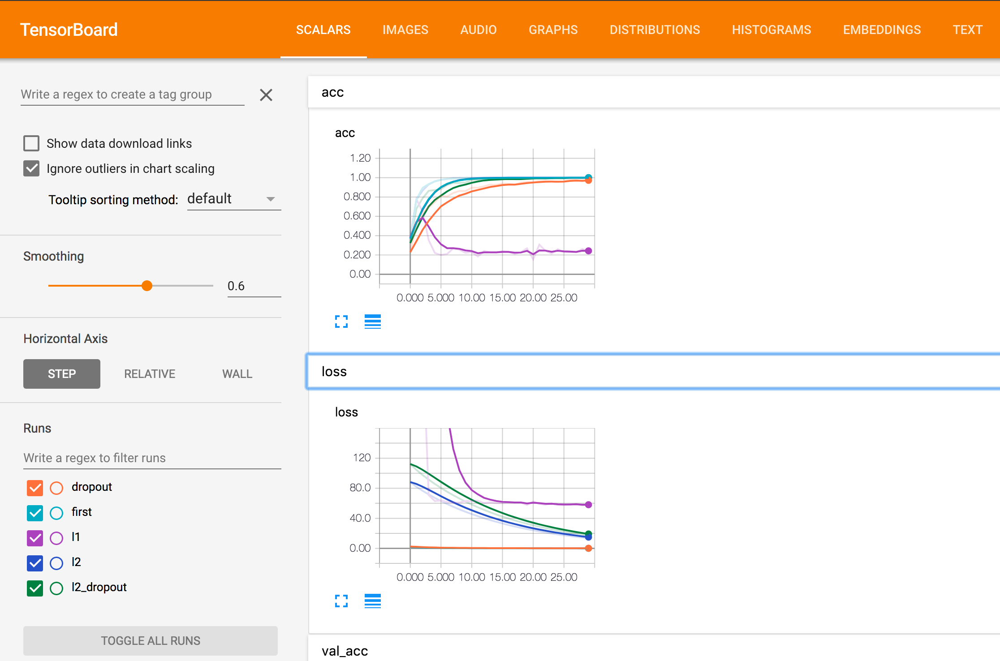

```{r setup, include=FALSE}
knitr::opts_chunk$set(echo = TRUE)
```

#### 패키지 로딩 

```{r}
library(keras)
library(reticulate)
```


#### 데이터 셋 및 시각화 함수 정의 

```{r}
mnist <- dataset_mnist()
x_train <- mnist$train$x
y_train <- mnist$train$y
x_test <- mnist$test$x
y_test <- mnist$test$y

x_train <- array(as.numeric(x_train), dim = c(dim(x_train)[[1]], 784))
x_test <- array(as.numeric(x_test), dim = c(dim(x_test)[[1]], 784))

# convert class vectors to binary class matrices
y_train <- to_categorical(y_train, 10)
y_test <- to_categorical(y_test, 10)

x_train_short <- x_train[1:5000,]
y_train_short <- y_train[1:5000,]

print(dim(x_train_short))
print(dim(y_train_short))
```

#### 예제 시각화 

```{r}
plot_examples <- function(data, labels, model_predict){
    par(mfrow=c(2,4))
    for(i in 1:8){
        idx <- sample(seq(dim(data)[1]), 1)
        lab <- paste0("num: " , which.max(labels[idx,]) - 1 , "," , which.max(model_predict[idx,]) - 1)
        image(t(apply(array(data[idx,], dim = c(28,28)), 2, rev)),
              col=paste("gray",1:99,sep=""),main=lab)
    }
}

plot_examples(x_train, y_train, y_train)
```

```{r}
plot_examples(x_test, y_test, y_test)
```

#### 동기 부여를 위해 적은 데이터로 너무 많은 노드를 추가해 보자! 

```{r}
inputs <- layer_input(shape = c(784))
 
predictions <- inputs %>%
  layer_dense(units = 1024, activation = 'sigmoid') %>% 
  layer_dense(units = 10, activation = 'softmax')

# 모형을 생성한다. 
model <- keras_model(inputs = inputs, outputs = predictions)

#모형 구조 출력 
summary(model)

sgd_lr <- optimizer_sgd(lr=0.01)
#컴파일 과정을 통해 최적화 조건을 선언한다. 
model %>% compile(
  optimizer = sgd_lr,
  loss = 'categorical_crossentropy',
  metrics = c('accuracy')
)

#학습 
cat(py_capture_output({
  history <- model %>% fit(
    x_train_short, y_train_short,
    batch_size = 32,
    epochs = 30,
    verbose = 2,
    validation_split=0.9, 
    callback_tensorboard(log_dir = "logs2/first")
  )
},type = 'stdout'))

```


#### Helper functions


```{r}
accuracy <- function(test_x, test_y, model){
  result <- predict(model,test_x)
  num_correct <- apply(result, 1, which.max) == apply(test_y, 1, which.max)
  accuracy <- sum(num_correct) / dim(result)[1]
  print(sprintf("Accuracy on data is: %f",accuracy * 100))
}

get_correct_and_incorrect <- function(model, test_x, test_y){
  result <- predict(model,test_x)
  correct_indices <- apply(result, 1, which.max) == apply(test_y, 1, which.max)
  test_x_correct <- test_x[correct_indices,]
  test_y_correct <- test_y[correct_indices,]
  predict_test_y_correct <- result[correct_indices,]
  incorrect_indices <- apply(result, 1, which.max) != apply(test_y, 1, which.max)
  test_x_incorrect <- test_x[incorrect_indices,]
  test_y_incorrect <- test_y[incorrect_indices,]
  predict_test_y_incorrect <- result[incorrect_indices,]
  return(list(test_x_correct, test_y_correct, test_x_incorrect, test_y_incorrect, predict_test_y_correct, predict_test_y_incorrect))
}
```

```{r}
accuracy(x_test, y_test, model)
```

#### L1 and L2 weight regularization

- L2 가중치 정규화 
    + 정규화 파라메터 수정을 하게 되면 어떠한 현상이 일어나는가? 
    + loss에는 어떠한 현상이 발생되는가?


```{r}
inputs <- layer_input(shape = c(784))
 
predictions <- inputs %>%
  layer_dense(units = 1024, activation = 'sigmoid',kernel_regularizer=regularizer_l2(0.1)) %>% 
  layer_dense(units = 10, activation = 'softmax')

# 모형을 생성한다. 
model <- keras_model(inputs = inputs, outputs = predictions)

#모형 구조 출력 
summary(model)

sgd_lr <- optimizer_sgd(lr=0.01)
#컴파일 과정을 통해 최적화 조건을 선언한다. 
model %>% compile(
  optimizer = sgd_lr,
  loss = 'categorical_crossentropy',
  metrics = c('accuracy')
)

#학습 
cat(py_capture_output({
  history <- model %>% fit(
    x_train_short, y_train_short,
    batch_size = 32,
    epochs = 30,
    verbose = 2,
    validation_split=0.9,
    callback_tensorboard(log_dir = "logs2/l2")
  )
},type = 'stdout'))

```


```{r}
accuracy(x_test, y_test, model)
```


#### L1 weight regularization

- 정규화 파라메터 수정을 하게 되면 어떠한 현상이 일어나는가? 


```{r}
inputs <- layer_input(shape = c(784))
 
predictions <- inputs %>%
  layer_dense(units = 1024, activation = 'sigmoid',kernel_regularizer=regularizer_l1(0.1)) %>% 
  layer_dense(units = 10, activation = 'softmax')

# 모형을 생성한다. 
model <- keras_model(inputs = inputs, outputs = predictions)

#모형 구조 출력 
summary(model)

sgd_lr <- optimizer_sgd(lr=0.01)
#컴파일 과정을 통해 최적화 조건을 선언한다. 
model %>% compile(
  optimizer = sgd_lr,
  loss = 'categorical_crossentropy',
  metrics = c('accuracy')
)

#학습 
cat(py_capture_output({
  history <- model %>% fit(
    x_train_short, y_train_short,
    batch_size = 32,
    epochs = 30,
    verbose = 2,
    validation_split=0.9,
    callback_tensorboard(log_dir = "logs2/l1")
  )
},type = 'stdout'))

```

```{r}
accuracy(x_test, y_test, model)
```


#### Dropout

- 파라메터 수정을 하게 되면 어떠한 현상이 일어나는가? 
- 테스트/학습시 dropout은 다르게 동작하는데, 특히 테스트의 경우 입력 노드의 숫자가 두배로 증가하기 때문에 입력 노드의 가중치에 0.5를 곱하는 후처리를 해줘야 된다. 
    + `keras`는 이러한 동작을 내부적으로 자동으로 처리해준다. 
    


```{r}
inputs <- layer_input(shape = c(784))
 
predictions <- inputs %>%
  layer_dense(units = 1024, activation = 'sigmoid') %>% 
  layer_dropout(rate=0.5) %>% 
  layer_dense(units = 10, activation = 'softmax')

# 모형을 생성한다. 
model <- keras_model(inputs = inputs, outputs = predictions)

#모형 구조 출력 
summary(model)

sgd_lr <- optimizer_sgd(lr=0.01)
#컴파일 과정을 통해 최적화 조건을 선언한다. 
model %>% compile(
  optimizer = sgd_lr,
  loss = 'categorical_crossentropy',
  metrics = c('accuracy')
)

#학습 
cat(py_capture_output({
  history <- model %>% fit(
    x_train_short, y_train_short,
    batch_size = 32,
    epochs = 30,
    verbose = 2,
    validation_split=0.9,
    callback_tensorboard(log_dir = "logs2/dropout")
  )
},type = 'stdout'))


```


```{r}
accuracy(x_test, y_test, model)
```

#### Combining different types of regularization

- L2 and Dropout

```{r}
inputs <- layer_input(shape = c(784))
 
predictions <- inputs %>%
  layer_dense(units = 2048, activation = 'sigmoid',kernel_regularizer=regularizer_l2(0.1)) %>% 
  layer_dropout(rate=0.5) %>% 
  layer_dense(units = 10, activation = 'softmax')

# 모형을 생성한다. 
model <- keras_model(inputs = inputs, outputs = predictions)

#모형 구조 출력 
summary(model)

sgd_lr <- optimizer_sgd(lr=0.01)
#컴파일 과정을 통해 최적화 조건을 선언한다. 
model %>% compile(
  optimizer = sgd_lr,
  loss = 'categorical_crossentropy',
  metrics = c('accuracy')
)

#학습 
cat(py_capture_output({
  history <- model %>% fit(
    x_train_short, y_train_short,
    batch_size = 32,
    epochs = 30,
    verbose = 2,
    validation_split=0.9,
    callback_tensorboard(log_dir = "logs2/l2_dropout")
  )
},type = 'stdout'))

```


```{r}
accuracy(x_test, y_test, model)
```


```{r,eval=F}
#텐서보드 띄워 보기 
tensorboard(log_dir = 'lectures/logs2/',host = '0.0.0.0', port = 8002)
```



