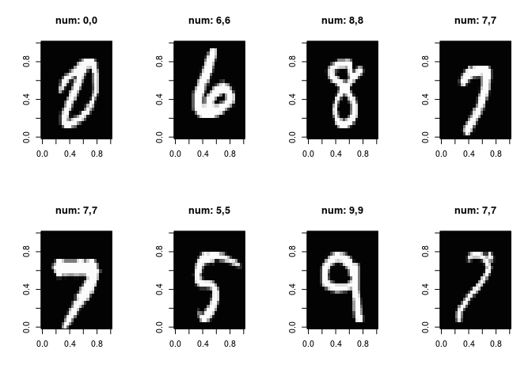

Keras Regularization
================

#### 패키지 로딩

``` r
library(keras)
library(reticulate)
```

#### 데이터 셋 및 시각화 함수 정의

``` r
mnist <- dataset_mnist()
x_train <- mnist$train$x
y_train <- mnist$train$y
x_test <- mnist$test$x
y_test <- mnist$test$y

x_train <- array(as.numeric(x_train), dim = c(dim(x_train)[[1]], 784))
x_test <- array(as.numeric(x_test), dim = c(dim(x_test)[[1]], 784))

# convert class vectors to binary class matrices
y_train <- to_categorical(y_train, 10)
y_test <- to_categorical(y_test, 10)

x_train_short <- x_train[1:5000,]
y_train_short <- y_train[1:5000,]

print(dim(x_train_short))
```

    ## [1] 5000  784

``` r
print(dim(y_train_short))
```

    ## [1] 5000   10

#### 예제 시각화

``` r
plot_examples <- function(data, labels, model_predict){
    par(mfrow=c(2,4))
    for(i in 1:8){
        idx <- sample(seq(dim(data)[1]), 1)
        lab <- paste0("num: " , which.max(labels[idx,]) - 1 , "," , which.max(model_predict[idx,]) - 1)
        image(t(apply(array(data[idx,], dim = c(28,28)), 2, rev)),
              col=paste("gray",1:99,sep=""),main=lab)
    }
}

plot_examples(x_train, y_train, y_train)
```



``` r
plot_examples(x_test, y_test, y_test)
```


#### 동기 부여를 위해 적은 데이터로 너무 많은 노드를 추가해 보자!

``` r
inputs <- layer_input(shape = c(784))
 
predictions <- inputs %>%
  layer_dense(units = 1024, activation = 'sigmoid') %>% 
  layer_dense(units = 10, activation = 'softmax')

# 모형을 생성한다. 
model <- keras_model(inputs = inputs, outputs = predictions)

#모형 구조 출력 
summary(model)
```

    ## Model
    ## ___________________________________________________________________________
    ## Layer (type)                     Output Shape                  Param #     
    ## ===========================================================================
    ## input_1 (InputLayer)             (None, 784)                   0           
    ## ___________________________________________________________________________
    ## dense_1 (Dense)                  (None, 1024)                  803840      
    ## ___________________________________________________________________________
    ## dense_2 (Dense)                  (None, 10)                    10250       
    ## ===========================================================================
    ## Total params: 814,090
    ## Trainable params: 814,090
    ## Non-trainable params: 0
    ## ___________________________________________________________________________
    ## 
    ## 

``` r
sgd_lr <- optimizer_sgd(lr=0.01)
#컴파일 과정을 통해 최적화 조건을 선언한다. 
model %>% compile(
  optimizer = sgd_lr,
  loss = 'categorical_crossentropy',
  metrics = c('accuracy')
)

#학습 
cat(py_capture_output({
  history <- model %>% fit(
    x_train_short, y_train_short,
    batch_size = 32,
    epochs = 30,
    verbose = 2,
    validation_split=0.9, 
    callback_tensorboard(log_dir = "logs2/first")
  )
},type = 'stdout'))
```

    ## Train on 499 samples, validate on 4501 samples
    ## Epoch 1/30
    ## 0s - loss: 2.0056 - acc: 0.3427 - val_loss: 1.5531 - val_acc: 0.5701
    ## Epoch 2/30
    ## 0s - loss: 1.0589 - acc: 0.7996 - val_loss: 1.2474 - val_acc: 0.6694
    ## Epoch 3/30
    ## 0s - loss: 0.7058 - acc: 0.8878 - val_loss: 1.0766 - val_acc: 0.7216
    ## Epoch 4/30
    ## 0s - loss: 0.5248 - acc: 0.9419 - val_loss: 0.9919 - val_acc: 0.7392
    ## Epoch 5/30
    ## 0s - loss: 0.4093 - acc: 0.9619 - val_loss: 0.9194 - val_acc: 0.7567
    ## Epoch 6/30
    ## 0s - loss: 0.3277 - acc: 0.9760 - val_loss: 0.8821 - val_acc: 0.7638
    ## Epoch 7/30
    ## 0s - loss: 0.2751 - acc: 0.9880 - val_loss: 0.8677 - val_acc: 0.7578
    ## Epoch 8/30
    ## 0s - loss: 0.2378 - acc: 0.9900 - val_loss: 0.8296 - val_acc: 0.7736
    ## Epoch 9/30
    ## 0s - loss: 0.2105 - acc: 0.9920 - val_loss: 0.8103 - val_acc: 0.7778
    ## Epoch 10/30
    ## 0s - loss: 0.1911 - acc: 0.9920 - val_loss: 0.7962 - val_acc: 0.7776
    ## Epoch 11/30
    ## 0s - loss: 0.1743 - acc: 0.9920 - val_loss: 0.7850 - val_acc: 0.7818
    ## Epoch 12/30
    ## 0s - loss: 0.1611 - acc: 0.9920 - val_loss: 0.7723 - val_acc: 0.7838
    ## Epoch 13/30
    ## 0s - loss: 0.1516 - acc: 0.9920 - val_loss: 0.7622 - val_acc: 0.7872
    ## Epoch 14/30
    ## 0s - loss: 0.1426 - acc: 0.9980 - val_loss: 0.7556 - val_acc: 0.7863
    ## Epoch 15/30
    ## 0s - loss: 0.1348 - acc: 0.9960 - val_loss: 0.7464 - val_acc: 0.7898
    ## Epoch 16/30
    ## 0s - loss: 0.1286 - acc: 0.9960 - val_loss: 0.7416 - val_acc: 0.7876
    ## Epoch 17/30
    ## 0s - loss: 0.1235 - acc: 0.9980 - val_loss: 0.7326 - val_acc: 0.7914
    ## Epoch 18/30
    ## 0s - loss: 0.1181 - acc: 0.9980 - val_loss: 0.7303 - val_acc: 0.7898
    ## Epoch 19/30
    ## 0s - loss: 0.1135 - acc: 0.9980 - val_loss: 0.7222 - val_acc: 0.7923
    ## Epoch 20/30
    ## 0s - loss: 0.1093 - acc: 0.9980 - val_loss: 0.7193 - val_acc: 0.7936
    ## Epoch 21/30
    ## 0s - loss: 0.1055 - acc: 0.9980 - val_loss: 0.7129 - val_acc: 0.7958
    ## Epoch 22/30
    ## 0s - loss: 0.1016 - acc: 0.9980 - val_loss: 0.7098 - val_acc: 0.7949
    ## Epoch 23/30
    ## 0s - loss: 0.0983 - acc: 0.9980 - val_loss: 0.7033 - val_acc: 0.7983
    ## Epoch 24/30
    ## 0s - loss: 0.0953 - acc: 0.9980 - val_loss: 0.7011 - val_acc: 0.7974
    ## Epoch 25/30
    ## 0s - loss: 0.0923 - acc: 1.0000 - val_loss: 0.6999 - val_acc: 0.7960
    ## Epoch 26/30
    ## 0s - loss: 0.0898 - acc: 1.0000 - val_loss: 0.6936 - val_acc: 0.7980
    ## Epoch 27/30
    ## 0s - loss: 0.0869 - acc: 1.0000 - val_loss: 0.6896 - val_acc: 0.7989
    ## Epoch 28/30
    ## 0s - loss: 0.0845 - acc: 1.0000 - val_loss: 0.6882 - val_acc: 0.7987
    ## Epoch 29/30
    ## 0s - loss: 0.0823 - acc: 1.0000 - val_loss: 0.6847 - val_acc: 0.7985
    ## Epoch 30/30
    ## 0s - loss: 0.0801 - acc: 1.0000 - val_loss: 0.6830 - val_acc: 0.7987

#### Helper functions

``` r
accuracy <- function(test_x, test_y, model){
  result <- predict(model,test_x)
  num_correct <- apply(result, 1, which.max) == apply(test_y, 1, which.max)
  accuracy <- sum(num_correct) / dim(result)[1]
  print(sprintf("Accuracy on data is: %f",accuracy * 100))
}

get_correct_and_incorrect <- function(model, test_x, test_y){
  result <- predict(model,test_x)
  correct_indices <- apply(result, 1, which.max) == apply(test_y, 1, which.max)
  test_x_correct <- test_x[correct_indices,]
  test_y_correct <- test_y[correct_indices,]
  predict_test_y_correct <- result[correct_indices,]
  incorrect_indices <- apply(result, 1, which.max) != apply(test_y, 1, which.max)
  test_x_incorrect <- test_x[incorrect_indices,]
  test_y_incorrect <- test_y[incorrect_indices,]
  predict_test_y_incorrect <- result[incorrect_indices,]
  return(list(test_x_correct, test_y_correct, test_x_incorrect, test_y_incorrect, predict_test_y_correct, predict_test_y_incorrect))
}
```

``` r
accuracy(x_test, y_test, model)
```

    ## [1] "Accuracy on data is: 79.310000"

#### L1 and L2 weight regularization

-   L2 가중치 정규화
    -   정규화 파라메터 수정을 하게 되면 어떠한 현상이 일어나는가?
    -   loss에는 어떠한 현상이 발생되는가?

``` r
inputs <- layer_input(shape = c(784))
 
predictions <- inputs %>%
  layer_dense(units = 1024, activation = 'sigmoid',kernel_regularizer=regularizer_l2(0.1)) %>% 
  layer_dense(units = 10, activation = 'softmax')

# 모형을 생성한다. 
model <- keras_model(inputs = inputs, outputs = predictions)

#모형 구조 출력 
summary(model)
```

    ## Model
    ## ___________________________________________________________________________
    ## Layer (type)                     Output Shape                  Param #     
    ## ===========================================================================
    ## input_2 (InputLayer)             (None, 784)                   0           
    ## ___________________________________________________________________________
    ## dense_3 (Dense)                  (None, 1024)                  803840      
    ## ___________________________________________________________________________
    ## dense_4 (Dense)                  (None, 10)                    10250       
    ## ===========================================================================
    ## Total params: 814,090
    ## Trainable params: 814,090
    ## Non-trainable params: 0
    ## ___________________________________________________________________________
    ## 
    ## 

``` r
sgd_lr <- optimizer_sgd(lr=0.01)
#컴파일 과정을 통해 최적화 조건을 선언한다. 
model %>% compile(
  optimizer = sgd_lr,
  loss = 'categorical_crossentropy',
  metrics = c('accuracy')
)

#학습 
cat(py_capture_output({
  history <- model %>% fit(
    x_train_short, y_train_short,
    batch_size = 32,
    epochs = 30,
    verbose = 2,
    validation_split=0.9,
    callback_tensorboard(log_dir = "logs2/l2")
  )
},type = 'stdout'))
```

    ## Train on 499 samples, validate on 4501 samples
    ## Epoch 1/30
    ## 0s - loss: 88.1708 - acc: 0.3587 - val_loss: 84.8603 - val_acc: 0.5237
    ## Epoch 2/30
    ## 0s - loss: 81.9642 - acc: 0.7695 - val_loss: 79.3499 - val_acc: 0.6639
    ## Epoch 3/30
    ## 0s - loss: 76.6034 - acc: 0.8697 - val_loss: 74.3825 - val_acc: 0.6790
    ## Epoch 4/30
    ## 0s - loss: 71.7159 - acc: 0.9218 - val_loss: 69.7094 - val_acc: 0.7421
    ## Epoch 5/30
    ## 0s - loss: 67.1801 - acc: 0.9599 - val_loss: 65.3891 - val_acc: 0.7529
    ## Epoch 6/30
    ## 0s - loss: 62.9584 - acc: 0.9920 - val_loss: 61.3363 - val_acc: 0.7656
    ## Epoch 7/30
    ## 0s - loss: 59.0146 - acc: 0.9940 - val_loss: 57.5528 - val_acc: 0.7776
    ## Epoch 8/30
    ## 0s - loss: 55.3262 - acc: 0.9940 - val_loss: 54.0217 - val_acc: 0.7703
    ## Epoch 9/30
    ## 0s - loss: 51.8771 - acc: 0.9960 - val_loss: 50.6958 - val_acc: 0.7783
    ## Epoch 10/30
    ## 0s - loss: 48.6478 - acc: 1.0000 - val_loss: 47.5862 - val_acc: 0.7832
    ## Epoch 11/30
    ## 0s - loss: 45.6248 - acc: 1.0000 - val_loss: 44.6632 - val_acc: 0.7885
    ## Epoch 12/30
    ## 0s - loss: 42.7900 - acc: 1.0000 - val_loss: 41.9287 - val_acc: 0.7883
    ## Epoch 13/30
    ## 0s - loss: 40.1335 - acc: 1.0000 - val_loss: 39.3615 - val_acc: 0.7896
    ## Epoch 14/30
    ## 0s - loss: 37.6416 - acc: 1.0000 - val_loss: 36.9598 - val_acc: 0.7876
    ## Epoch 15/30
    ## 0s - loss: 35.3058 - acc: 1.0000 - val_loss: 34.7022 - val_acc: 0.7889
    ## Epoch 16/30
    ## 0s - loss: 33.1158 - acc: 1.0000 - val_loss: 32.5853 - val_acc: 0.7909
    ## Epoch 17/30
    ## 0s - loss: 31.0615 - acc: 1.0000 - val_loss: 30.6035 - val_acc: 0.7905
    ## Epoch 18/30
    ## 0s - loss: 29.1348 - acc: 1.0000 - val_loss: 28.7365 - val_acc: 0.7949
    ## Epoch 19/30
    ## 0s - loss: 27.3283 - acc: 1.0000 - val_loss: 26.9901 - val_acc: 0.7938
    ## Epoch 20/30
    ## 0s - loss: 25.6333 - acc: 1.0000 - val_loss: 25.3513 - val_acc: 0.7945
    ## Epoch 21/30
    ## 0s - loss: 24.0440 - acc: 1.0000 - val_loss: 23.8145 - val_acc: 0.7974
    ## Epoch 22/30
    ## 0s - loss: 22.5534 - acc: 1.0000 - val_loss: 22.3734 - val_acc: 0.7978
    ## Epoch 23/30
    ## 0s - loss: 21.1552 - acc: 1.0000 - val_loss: 21.0222 - val_acc: 0.7985
    ## Epoch 24/30
    ## 0s - loss: 19.8438 - acc: 1.0000 - val_loss: 19.7538 - val_acc: 0.7976
    ## Epoch 25/30
    ## 0s - loss: 18.6134 - acc: 1.0000 - val_loss: 18.5643 - val_acc: 0.8023
    ## Epoch 26/30
    ## 0s - loss: 17.4596 - acc: 1.0000 - val_loss: 17.4488 - val_acc: 0.8000
    ## Epoch 27/30
    ## 0s - loss: 16.3774 - acc: 1.0000 - val_loss: 16.4013 - val_acc: 0.8025
    ## Epoch 28/30
    ## 0s - loss: 15.3624 - acc: 1.0000 - val_loss: 15.4161 - val_acc: 0.8049
    ## Epoch 29/30
    ## 0s - loss: 14.4101 - acc: 1.0000 - val_loss: 14.4965 - val_acc: 0.8040
    ## Epoch 30/30
    ## 0s - loss: 13.5171 - acc: 1.0000 - val_loss: 13.6330 - val_acc: 0.8045

``` r
accuracy(x_test, y_test, model)
```

    ## [1] "Accuracy on data is: 80.580000"

#### L1 weight regularization

-   정규화 파라메터 수정을 하게 되면 어떠한 현상이 일어나는가?

``` r
inputs <- layer_input(shape = c(784))
 
predictions <- inputs %>%
  layer_dense(units = 1024, activation = 'sigmoid',kernel_regularizer=regularizer_l1(0.1)) %>% 
  layer_dense(units = 10, activation = 'softmax')

# 모형을 생성한다. 
model <- keras_model(inputs = inputs, outputs = predictions)

#모형 구조 출력 
summary(model)
```

    ## Model
    ## ___________________________________________________________________________
    ## Layer (type)                     Output Shape                  Param #     
    ## ===========================================================================
    ## input_3 (InputLayer)             (None, 784)                   0           
    ## ___________________________________________________________________________
    ## dense_5 (Dense)                  (None, 1024)                  803840      
    ## ___________________________________________________________________________
    ## dense_6 (Dense)                  (None, 10)                    10250       
    ## ===========================================================================
    ## Total params: 814,090
    ## Trainable params: 814,090
    ## Non-trainable params: 0
    ## ___________________________________________________________________________
    ## 
    ## 

``` r
sgd_lr <- optimizer_sgd(lr=0.01)
#컴파일 과정을 통해 최적화 조건을 선언한다. 
model %>% compile(
  optimizer = sgd_lr,
  loss = 'categorical_crossentropy',
  metrics = c('accuracy')
)

#학습 
cat(py_capture_output({
  history <- model %>% fit(
    x_train_short, y_train_short,
    batch_size = 32,
    epochs = 30,
    verbose = 2,
    validation_split=0.9,
    callback_tensorboard(log_dir = "logs2/l1")
  )
},type = 'stdout'))
```

    ## Train on 499 samples, validate on 4501 samples
    ## Epoch 1/30
    ## 0s - loss: 1785.2297 - acc: 0.3848 - val_loss: 1220.3727 - val_acc: 0.5146
    ## Epoch 2/30
    ## 0s - loss: 852.7304 - acc: 0.7615 - val_loss: 482.5384 - val_acc: 0.6392
    ## Epoch 3/30
    ## 0s - loss: 280.0506 - acc: 0.6473 - val_loss: 115.0753 - val_acc: 0.3039
    ## Epoch 4/30
    ## 0s - loss: 71.5677 - acc: 0.3186 - val_loss: 66.7889 - val_acc: 0.1069
    ## Epoch 5/30
    ## 0s - loss: 63.9500 - acc: 0.2044 - val_loss: 64.4912 - val_acc: 0.2322
    ## Epoch 6/30
    ## 0s - loss: 63.0584 - acc: 0.2385 - val_loss: 66.5936 - val_acc: 0.1991
    ## Epoch 7/30
    ## 0s - loss: 61.3745 - acc: 0.2605 - val_loss: 58.0090 - val_acc: 0.2419
    ## Epoch 8/30
    ## 0s - loss: 61.0569 - acc: 0.2204 - val_loss: 58.4634 - val_acc: 0.1393
    ## Epoch 9/30
    ## 0s - loss: 61.4836 - acc: 0.2485 - val_loss: 61.5128 - val_acc: 0.1073
    ## Epoch 10/30
    ## 0s - loss: 62.6924 - acc: 0.2305 - val_loss: 62.4906 - val_acc: 0.1866
    ## Epoch 11/30
    ## 0s - loss: 60.0915 - acc: 0.2665 - val_loss: 62.7789 - val_acc: 0.2535
    ## Epoch 12/30
    ## 0s - loss: 61.8833 - acc: 0.2184 - val_loss: 60.1265 - val_acc: 0.2044
    ## Epoch 13/30
    ## 0s - loss: 62.2545 - acc: 0.2365 - val_loss: 63.1126 - val_acc: 0.2446
    ## Epoch 14/30
    ## 0s - loss: 61.5555 - acc: 0.2405 - val_loss: 64.7248 - val_acc: 0.1955
    ## Epoch 15/30
    ## 0s - loss: 61.3534 - acc: 0.2064 - val_loss: 67.5796 - val_acc: 0.2266
    ## Epoch 16/30
    ## 0s - loss: 62.0704 - acc: 0.2605 - val_loss: 62.5856 - val_acc: 0.1888
    ## Epoch 17/30
    ## 0s - loss: 61.2334 - acc: 0.1904 - val_loss: 60.5134 - val_acc: 0.1975
    ## Epoch 18/30
    ## 0s - loss: 59.1037 - acc: 0.2385 - val_loss: 64.9267 - val_acc: 0.1031
    ## Epoch 19/30
    ## 0s - loss: 60.0951 - acc: 0.2405 - val_loss: 66.8212 - val_acc: 0.1775
    ## Epoch 20/30
    ## 0s - loss: 61.5159 - acc: 0.2204 - val_loss: 62.8443 - val_acc: 0.0878
    ## Epoch 21/30
    ## 0s - loss: 60.1841 - acc: 0.2325 - val_loss: 61.3460 - val_acc: 0.1997
    ## Epoch 22/30
    ## 0s - loss: 60.2358 - acc: 0.2044 - val_loss: 58.4594 - val_acc: 0.2802
    ## Epoch 23/30
    ## 0s - loss: 59.3979 - acc: 0.2345 - val_loss: 58.2181 - val_acc: 0.1238
    ## Epoch 24/30
    ## 0s - loss: 59.3613 - acc: 0.2425 - val_loss: 56.2199 - val_acc: 0.2188
    ## Epoch 25/30
    ## 0s - loss: 59.0373 - acc: 0.2505 - val_loss: 68.2091 - val_acc: 0.1497
    ## Epoch 26/30
    ## 0s - loss: 60.4352 - acc: 0.2144 - val_loss: 66.9557 - val_acc: 0.1569
    ## Epoch 27/30
    ## 0s - loss: 59.0127 - acc: 0.2184 - val_loss: 59.0704 - val_acc: 0.1537
    ## Epoch 28/30
    ## 0s - loss: 57.6234 - acc: 0.2505 - val_loss: 58.1992 - val_acc: 0.2084
    ## Epoch 29/30
    ## 0s - loss: 57.9505 - acc: 0.2325 - val_loss: 59.2909 - val_acc: 0.3097
    ## Epoch 30/30
    ## 0s - loss: 56.8575 - acc: 0.2826 - val_loss: 61.6420 - val_acc: 0.3253

``` r
accuracy(x_test, y_test, model)
```

    ## [1] "Accuracy on data is: 31.370000"

#### Dropout

-   파라메터 수정을 하게 되면 어떠한 현상이 일어나는가?
-   테스트/학습시 dropout은 다르게 동작하는데, 특히 테스트의 경우 입력 노드의 숫자가 두배로 증가하기 때문에 입력 노드의 가중치에 0.5를 곱하는 후처리를 해줘야 된다.
    -   `keras`는 이러한 동작을 내부적으로 자동으로 처리해준다.

``` r
inputs <- layer_input(shape = c(784))
 
predictions <- inputs %>%
  layer_dense(units = 1024, activation = 'sigmoid') %>% 
  layer_dropout(rate=0.5) %>% 
  layer_dense(units = 10, activation = 'softmax')

# 모형을 생성한다. 
model <- keras_model(inputs = inputs, outputs = predictions)

#모형 구조 출력 
summary(model)
```

    ## Model
    ## ___________________________________________________________________________
    ## Layer (type)                     Output Shape                  Param #     
    ## ===========================================================================
    ## input_4 (InputLayer)             (None, 784)                   0           
    ## ___________________________________________________________________________
    ## dense_7 (Dense)                  (None, 1024)                  803840      
    ## ___________________________________________________________________________
    ## dropout_1 (Dropout)              (None, 1024)                  0           
    ## ___________________________________________________________________________
    ## dense_8 (Dense)                  (None, 10)                    10250       
    ## ===========================================================================
    ## Total params: 814,090
    ## Trainable params: 814,090
    ## Non-trainable params: 0
    ## ___________________________________________________________________________
    ## 
    ## 

``` r
sgd_lr <- optimizer_sgd(lr=0.01)
#컴파일 과정을 통해 최적화 조건을 선언한다. 
model %>% compile(
  optimizer = sgd_lr,
  loss = 'categorical_crossentropy',
  metrics = c('accuracy')
)

#학습 
cat(py_capture_output({
  history <- model %>% fit(
    x_train_short, y_train_short,
    batch_size = 32,
    epochs = 30,
    verbose = 2,
    validation_split=0.9,
    callback_tensorboard(log_dir = "logs2/dropout")
  )
},type = 'stdout'))
```

    ## Train on 499 samples, validate on 4501 samples
    ## Epoch 1/30
    ## 0s - loss: 2.2396 - acc: 0.2505 - val_loss: 1.5683 - val_acc: 0.5425
    ## Epoch 2/30
    ## 0s - loss: 1.4942 - acc: 0.4870 - val_loss: 1.2963 - val_acc: 0.6241
    ## Epoch 3/30
    ## 0s - loss: 1.1086 - acc: 0.6874 - val_loss: 1.1065 - val_acc: 0.6983
    ## Epoch 4/30
    ## 0s - loss: 0.9636 - acc: 0.7275 - val_loss: 0.9713 - val_acc: 0.7358
    ## Epoch 5/30
    ## 0s - loss: 0.7768 - acc: 0.7836 - val_loss: 0.8931 - val_acc: 0.7592
    ## Epoch 6/30
    ## 0s - loss: 0.6749 - acc: 0.8236 - val_loss: 0.8310 - val_acc: 0.7698
    ## Epoch 7/30
    ## 0s - loss: 0.6095 - acc: 0.8417 - val_loss: 0.7930 - val_acc: 0.7732
    ## Epoch 8/30
    ## 0s - loss: 0.5373 - acc: 0.8517 - val_loss: 0.7667 - val_acc: 0.7785
    ## Epoch 9/30
    ## 0s - loss: 0.4906 - acc: 0.8677 - val_loss: 0.7473 - val_acc: 0.7792
    ## Epoch 10/30
    ## 0s - loss: 0.4308 - acc: 0.8878 - val_loss: 0.7187 - val_acc: 0.7832
    ## Epoch 11/30
    ## 0s - loss: 0.4454 - acc: 0.8818 - val_loss: 0.6940 - val_acc: 0.7920
    ## Epoch 12/30
    ## 0s - loss: 0.3915 - acc: 0.8918 - val_loss: 0.6893 - val_acc: 0.7876
    ## Epoch 13/30
    ## 0s - loss: 0.3171 - acc: 0.9279 - val_loss: 0.6742 - val_acc: 0.7969
    ## Epoch 14/30
    ## 0s - loss: 0.3165 - acc: 0.9198 - val_loss: 0.6649 - val_acc: 0.8038
    ## Epoch 15/30
    ## 0s - loss: 0.2935 - acc: 0.9319 - val_loss: 0.6424 - val_acc: 0.8043
    ## Epoch 16/30
    ## 0s - loss: 0.2756 - acc: 0.9459 - val_loss: 0.6371 - val_acc: 0.8045
    ## Epoch 17/30
    ## 0s - loss: 0.2798 - acc: 0.9319 - val_loss: 0.6245 - val_acc: 0.8100
    ## Epoch 18/30
    ## 0s - loss: 0.2467 - acc: 0.9499 - val_loss: 0.6245 - val_acc: 0.8069
    ## Epoch 19/30
    ## 0s - loss: 0.2252 - acc: 0.9619 - val_loss: 0.6141 - val_acc: 0.8149
    ## Epoch 20/30
    ## 0s - loss: 0.2177 - acc: 0.9559 - val_loss: 0.6040 - val_acc: 0.8163
    ## Epoch 21/30
    ## 0s - loss: 0.2125 - acc: 0.9579 - val_loss: 0.5978 - val_acc: 0.8198
    ## Epoch 22/30
    ## 0s - loss: 0.1995 - acc: 0.9719 - val_loss: 0.5987 - val_acc: 0.8149
    ## Epoch 23/30
    ## 0s - loss: 0.1868 - acc: 0.9699 - val_loss: 0.5925 - val_acc: 0.8212
    ## Epoch 24/30
    ## 0s - loss: 0.1955 - acc: 0.9639 - val_loss: 0.5877 - val_acc: 0.8192
    ## Epoch 25/30
    ## 0s - loss: 0.1779 - acc: 0.9679 - val_loss: 0.5811 - val_acc: 0.8198
    ## Epoch 26/30
    ## 0s - loss: 0.1641 - acc: 0.9719 - val_loss: 0.5810 - val_acc: 0.8205
    ## Epoch 27/30
    ## 0s - loss: 0.1634 - acc: 0.9679 - val_loss: 0.5802 - val_acc: 0.8198
    ## Epoch 28/30
    ## 0s - loss: 0.1598 - acc: 0.9659 - val_loss: 0.5739 - val_acc: 0.8189
    ## Epoch 29/30
    ## 0s - loss: 0.1462 - acc: 0.9760 - val_loss: 0.5666 - val_acc: 0.8265
    ## Epoch 30/30
    ## 0s - loss: 0.1352 - acc: 0.9860 - val_loss: 0.5704 - val_acc: 0.8232

``` r
accuracy(x_test, y_test, model)
```

    ## [1] "Accuracy on data is: 81.920000"

#### Combining different types of regularization

-   L2 and Dropout

``` r
inputs <- layer_input(shape = c(784))
 
predictions <- inputs %>%
  layer_dense(units = 2048, activation = 'sigmoid',kernel_regularizer=regularizer_l2(0.1)) %>% 
  layer_dropout(rate=0.5) %>% 
  layer_dense(units = 10, activation = 'softmax')

# 모형을 생성한다. 
model <- keras_model(inputs = inputs, outputs = predictions)

#모형 구조 출력 
summary(model)
```

    ## Model
    ## ___________________________________________________________________________
    ## Layer (type)                     Output Shape                  Param #     
    ## ===========================================================================
    ## input_5 (InputLayer)             (None, 784)                   0           
    ## ___________________________________________________________________________
    ## dense_9 (Dense)                  (None, 2048)                  1607680     
    ## ___________________________________________________________________________
    ## dropout_2 (Dropout)              (None, 2048)                  0           
    ## ___________________________________________________________________________
    ## dense_10 (Dense)                 (None, 10)                    20490       
    ## ===========================================================================
    ## Total params: 1,628,170
    ## Trainable params: 1,628,170
    ## Non-trainable params: 0
    ## ___________________________________________________________________________
    ## 
    ## 

``` r
sgd_lr <- optimizer_sgd(lr=0.01)
#컴파일 과정을 통해 최적화 조건을 선언한다. 
model %>% compile(
  optimizer = sgd_lr,
  loss = 'categorical_crossentropy',
  metrics = c('accuracy')
)

#학습 
cat(py_capture_output({
  history <- model %>% fit(
    x_train_short, y_train_short,
    batch_size = 32,
    epochs = 30,
    verbose = 2,
    validation_split=0.9,
    callback_tensorboard(log_dir = "logs2/l2_dropout")
  )
},type = 'stdout'))
```

    ## Train on 499 samples, validate on 4501 samples
    ## Epoch 1/30
    ## 0s - loss: 112.2160 - acc: 0.3186 - val_loss: 107.7351 - val_acc: 0.6219
    ## Epoch 2/30
    ## 0s - loss: 104.5343 - acc: 0.6393 - val_loss: 100.9413 - val_acc: 0.6499
    ## Epoch 3/30
    ## 0s - loss: 97.7437 - acc: 0.8096 - val_loss: 94.6192 - val_acc: 0.7236
    ## Epoch 4/30
    ## 0s - loss: 91.5911 - acc: 0.8557 - val_loss: 88.6806 - val_acc: 0.7765
    ## Epoch 5/30
    ## 0s - loss: 85.8799 - acc: 0.8858 - val_loss: 83.1937 - val_acc: 0.7947
    ## Epoch 6/30
    ## 0s - loss: 80.4959 - acc: 0.9078 - val_loss: 78.0556 - val_acc: 0.7969
    ## Epoch 7/30
    ## 0s - loss: 75.4605 - acc: 0.9178 - val_loss: 73.2524 - val_acc: 0.8025
    ## Epoch 8/30
    ## 0s - loss: 70.7796 - acc: 0.9419 - val_loss: 68.7351 - val_acc: 0.8083
    ## Epoch 9/30
    ## 0s - loss: 66.4126 - acc: 0.9299 - val_loss: 64.4925 - val_acc: 0.8080
    ## Epoch 10/30
    ## 0s - loss: 62.2594 - acc: 0.9619 - val_loss: 60.5213 - val_acc: 0.8200
    ## Epoch 11/30
    ## 0s - loss: 58.3965 - acc: 0.9639 - val_loss: 56.7890 - val_acc: 0.8223
    ## Epoch 12/30
    ## 0s - loss: 54.7713 - acc: 0.9619 - val_loss: 53.2896 - val_acc: 0.8258
    ## Epoch 13/30
    ## 0s - loss: 51.3562 - acc: 0.9860 - val_loss: 50.0133 - val_acc: 0.8289
    ## Epoch 14/30
    ## 0s - loss: 48.1587 - acc: 0.9860 - val_loss: 46.9399 - val_acc: 0.8307
    ## Epoch 15/30
    ## 0s - loss: 45.1754 - acc: 0.9840 - val_loss: 44.0489 - val_acc: 0.8360
    ## Epoch 16/30
    ## 0s - loss: 42.3787 - acc: 0.9840 - val_loss: 41.3556 - val_acc: 0.8356
    ## Epoch 17/30
    ## 0s - loss: 39.7404 - acc: 0.9920 - val_loss: 38.8238 - val_acc: 0.8318
    ## Epoch 18/30
    ## 0s - loss: 37.2721 - acc: 0.9940 - val_loss: 36.4492 - val_acc: 0.8347
    ## Epoch 19/30
    ## 0s - loss: 34.9669 - acc: 0.9940 - val_loss: 34.2052 - val_acc: 0.8389
    ## Epoch 20/30
    ## 0s - loss: 32.7975 - acc: 0.9920 - val_loss: 32.1161 - val_acc: 0.8349
    ## Epoch 21/30
    ## 0s - loss: 30.7575 - acc: 0.9980 - val_loss: 30.1569 - val_acc: 0.8347
    ## Epoch 22/30
    ## 0s - loss: 28.8517 - acc: 0.9980 - val_loss: 28.3271 - val_acc: 0.8360
    ## Epoch 23/30
    ## 0s - loss: 27.0614 - acc: 0.9980 - val_loss: 26.5868 - val_acc: 0.8436
    ## Epoch 24/30
    ## 0s - loss: 25.3779 - acc: 1.0000 - val_loss: 24.9682 - val_acc: 0.8374
    ## Epoch 25/30
    ## 0s - loss: 23.8075 - acc: 0.9960 - val_loss: 23.4496 - val_acc: 0.8451
    ## Epoch 26/30
    ## 0s - loss: 22.3358 - acc: 0.9940 - val_loss: 22.0349 - val_acc: 0.8391
    ## Epoch 27/30
    ## 0s - loss: 20.9489 - acc: 1.0000 - val_loss: 20.6936 - val_acc: 0.8431
    ## Epoch 28/30
    ## 0s - loss: 19.6474 - acc: 0.9980 - val_loss: 19.4332 - val_acc: 0.8438
    ## Epoch 29/30
    ## 0s - loss: 18.4272 - acc: 1.0000 - val_loss: 18.2538 - val_acc: 0.8449
    ## Epoch 30/30
    ## 0s - loss: 17.2813 - acc: 1.0000 - val_loss: 17.1515 - val_acc: 0.8451

``` r
accuracy(x_test, y_test, model)
```

    ## [1] "Accuracy on data is: 84.440000"

``` r
#텐서보드 띄워 보기 
tensorboard(log_dir = 'logs2/',host = '0.0.0.0', port = 8002)
```
